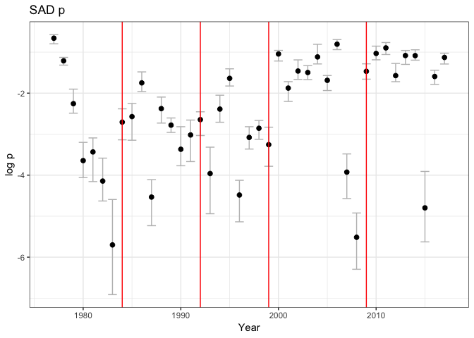
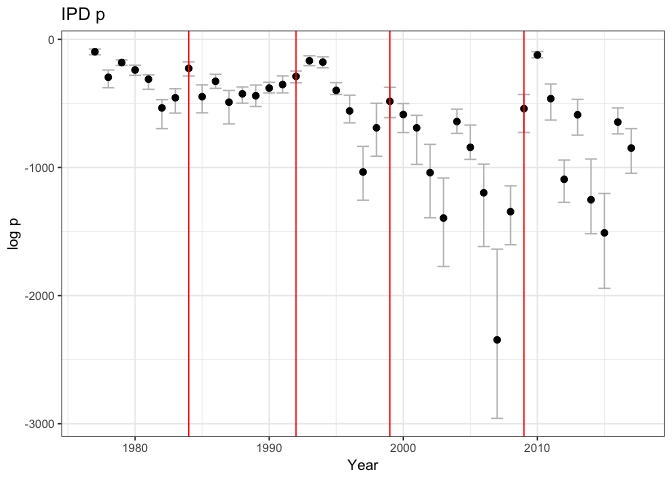

Portal yearly analysis
================
Renata Diaz
1/2/2019

Load data
---------

    ## Loading in data version 1.74.0

    ##   year species abund     power
    ## 1 1977      DM     1  90.50181
    ## 2 1977      DM     1 103.76316
    ## 3 1977      DM     1  71.10674
    ## 4 1977      DM     1 100.50337
    ## 5 1977      DM     1  83.62558
    ## 6 1977      DO     1 110.18305

Split by year
-------------

``` r
portal_yearly_communities <- list()

for(i in 1:length(unique(portal_granivores$year))) {
  this_year <- unique(portal_granivores$year)[i]
  portal_yearly_communities[[i]] <- extract_portal_year(portal_granivores, chosen_year= this_year)
  names(portal_yearly_communities)[i]<-this_year
}

#portal_yearly_communities <- portal_yearly_communities[1:10]
```

Get ps
------

``` r
for(i in 1:10) {
  

get_probs <- function(year, list_of_communities) {
  dir.create(paste0('./sim_storage_yearly_100draws/', i, '/'))

thisone <- list_of_communities[[year]]
thispath <- paste0('./sim_storage_yearly_100draws/', i, '/', year)
dir.create(thispath)
probs <- get_community_prob(thisone, thispath, 100)

return(probs)
}

all_probs <- lapply(X = names(portal_yearly_communities), FUN = get_probs,
                    list_of_communities = portal_yearly_communities)
names(all_probs) <- names(portal_yearly_communities)
all_probs_df <- as.data.frame(names(portal_yearly_communities))
colnames(all_probs_df) <- 'year'
get_distp_from_list <- function(year, list_of_ps, dist_index) {
return(as.numeric(list_of_ps[[year]][dist_index]))
  }

all_probs_df$sad_p <- vapply(all_probs_df$year, FUN = get_distp_from_list,
                             list_of_ps = all_probs, dist_index = 1, FUN.VALUE = as.numeric(all_probs[[1]][1]))
all_probs_df$ipd_p <- vapply(all_probs_df$year, FUN = get_distp_from_list,
                             list_of_ps = all_probs, dist_index = 2, FUN.VALUE = as.numeric(all_probs[[1]][1]))

print(all_probs_df)

write.csv(all_probs_df, paste0('./sim_storage_yearly_100draws/', i, '/probs_df.csv'),  row.names= F)

}
```

``` r
add_ps <- function(it_index) {
  
  this_path <- paste0('sim_storage_yearly_100draws/', it_index, '/probs_df.csv')
  
  new_df <- read.csv(this_path)
  new_df$it_index <- it_index
  
  return(new_df)
}

ps_100draws <- add_ps(1)
for(i in 2:10) {
  ps_100draws <- rbind(ps_100draws, add_ps(i))
}

summary_100draws <- ps_100draws %>%
  dplyr::mutate(year = as.numeric(year)) %>%
  dplyr::group_by(year) %>%
  dplyr::summarize(sad_mean = mean(sad_p), 
                   ipd_mean = mean(ipd_p),
                   sad_2p5 = quantile(sad_p, probs = 0.025), 
                   sad_97p5 = quantile(sad_p, probs = 0.975),
                   ipd_2p5 = quantile(ipd_p, probs=0.025),
                   ipd_97p5 = quantile(ipd_p, probs = 0.975)) %>%
  dplyr::ungroup() 
```


